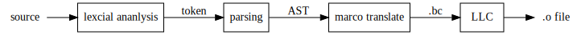

Design Manual - RedApple Compiler

RedApple is a fast, usable, C Style Compiler Infrastructure, which not only works independently as a little compiler, but also can be an embedding compiler library.

## Core Features

RedApple supports the following features:

1. Global Functions without Prior Declaration
2. Common Type System
3. Simplified Pointer
4. Constant Fields
5. Control Flow Statements
6. Metadata and Reflection
7. User Macros

Maybe a demo source code will show these features intuitively:

```c
int main() {
    // here we used the metadata to call
    // the 'print' function with its name
    FunctionCall("print", 5);
    return 0;
}


// user macro can make your grammar,
// and here we receved three parameters
defmacro for_n (p, size, code)  {
    for (int p = 1; p <= size; p = p+1)
        code;
}

void print(int k) {
    // call the user macro, i and k are two parameters,
    // the block '{}' is a parameter in its entirety.
    @for_n (i, k) {
        printf("hello-%d\n", i);
    }
}

```

Now we are going to discuss the design and how to make it.

## Introduce

Most compilers adhere to the basic structural models. These models can be divided into five consecutive processes, known as Lexical Analysis, Parsing, Semantic Analysis, Optimize Intermediate Code and Target Code Generation.

We used LLVM Infrastructure to optimize our intermediate bitcode and generate the object code.
So our working flow will be like the following figure:



The special point is that the Semantic Analysis was replaced by Macro Translation, which is used to extend the grammer more conveniently.


## Lexical Analysis and Parsing

To make a simple lexical analyzer, we used Flex, same as Lex, an unix utility for generating lexical analyzer that perform pattern-matching on text. It reads the Lex configuration file and generate C/C++ code which can be compile to a lexical analyzer library and has approximately the same high performance as hand-written analyzer.

A basic Lex configuration file has three parts which are splited by '%%':

```lex
/* C headers and definitions */

%%

 /* pattern-matching rules of tokens */

%%

/* user's C/C++ code */

```

Another core utility is Bison, a parser generator employing LALR(1) parser tables and fully backward compatible with Yacc. It has the configuration file same as Lex and has been designed working together with it. Next, we are going to explain the first two steps and how they are designed.

Here is the basic calculator made by Bison, which parses and calculates the line of expression:

```bison
/* parser.y */
/* Location tracking calculator.  */

%{
  #include <cmath>
  int yylex (void);
  void yyerror (char const *);
%}

/* Bison declarations.  */
%define api.value.type {int}
%token NUM

%left '-' '+'
%left '*' '/'
%precedence NEG
%right '^'

%% /* The grammar follows.  */

input:
  %empty
| input line
;

line:
  '\n'
| exp '\n' { printf ("%d\n", $1); }
;

exp:
  NUM           { $$ = $1; }
| exp '+' exp   { $$ = $1 + $3; }
| exp '-' exp   { $$ = $1 - $3; }
| exp '*' exp   { $$ = $1 * $3; }
| exp '/' exp
    {
      if ($3)
        $$ = $1 / $3;
      else
        {
          $$ = 1;
          fprintf (stderr, "%d.%d-%d.%d: division by zero",
                   @3.first_line, @3.first_column,
                   @3.last_line, @3.last_column);
        }
    }
| '-' exp %prec NEG     { $$ = -$2; }
| exp '^' exp           { $$ = pow ($1, $3); }
| '(' exp ')'           { $$ = $2; }

%%

int
main (void)
{
  return yyparse ();
}

```

We find that all the tokens are undefined, as a matter of fact, which will be defined in the configuration file of Lex.

```lex
/* scanner.l */

%{

#include "parser.hpp"
#include <cstdlib>

#define SAVE_TOKEN     yylval = maketoken(yytext, yyleng)
extern "C" int yywrap() { return 1; }
int maketoken(const char* data, int len);
%}

%%

[0-9]+                  SAVE_TOKEN; return NUM;

"("                     return '(';
")"                     return ')';
"+"                     return '+';
"-"                     return '-';
"*"                     return '*';
"/"                     return '/';
"^"                     return '^';

%%

int maketoken(const char* data, int len) {
    char* str = new char[len+1];
    strncpy(str, data, len);
    str[len] = 0;
    int num = atoi(str);
    delete str;
    return num;
}

```

Each token defined by the '.y' file will be a number which the pattern-matching returns (A char also can be known as a number).


### The Difficulties of Lexical Analysis

One of the difficulties is the comment analysis such as `/* */`. We need to enumerate all the possiblities in the Regex, which the classic solution looks like:

```lex

%%
"/*"([^\*]|(\*)*[^\*/])*(\*)*"*/" ; /* the comment likes this kind */

"/*"   (  [^\*]   |   (\*)* [^\*/]   )*   (\*)*    "*/" ;
```

Do not return anything means that lexical analyzer will discard the comment string.

Some other important regexs have been list below:

```lex
%{
#define SAVE_TOKEN     yylval.str = maketoken(yytext, yyleng)
#define SAVE_STRING    yylval.str = maketoken(yytext, yyleng)
#define SAVE_STRING_NC yylval.str = maketoken(yytext, yyleng)
%}

%%

/* some pattern-matching regexs */

[a-zA-Z_][a-zA-Z0-9_]*  SAVE_TOKEN; return ID; /* 标识符 */

-?[0-9]*\.[0-9]*        SAVE_TOKEN; return DOUBLE;
-?[0-9]+                SAVE_TOKEN; return INTEGER;
0x[0-9A-Fa-f]+          SAVE_TOKEN; return INTEGER;

\"(\\.|[^\\"])*\"       SAVE_STRING; return STRING; /* 字符串 */
@\"(\\.|[^\\"])*\"      SAVE_STRING_NC; return STRING; /* 无转义字符串 */
\'(\\.|.)\'             SAVE_STRING; return CHAR;   /* 字符 */

```


### The Generator of Common Nodes Tree
