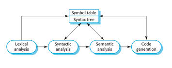
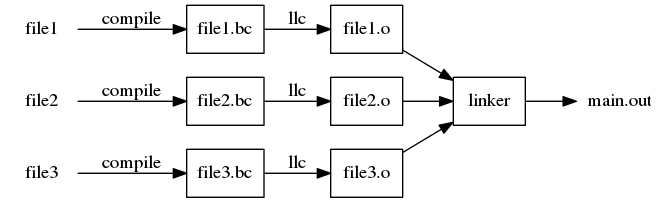
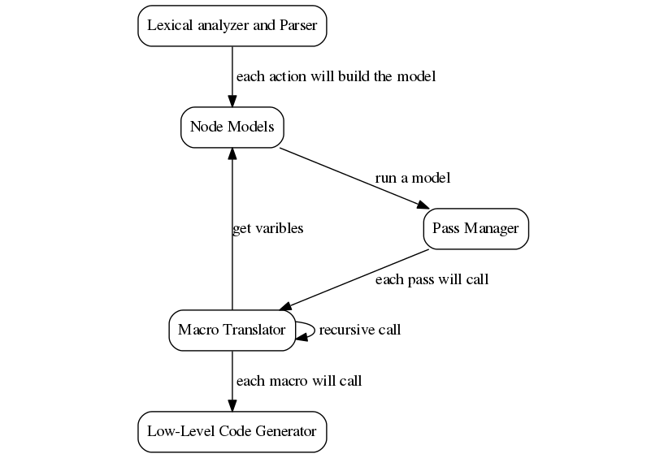
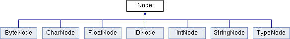
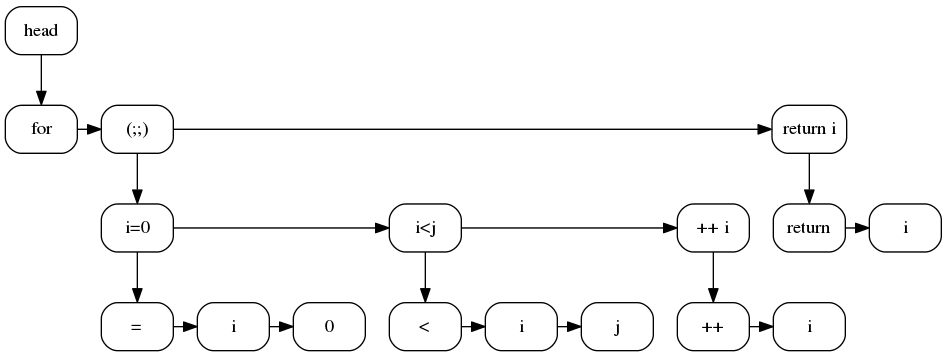
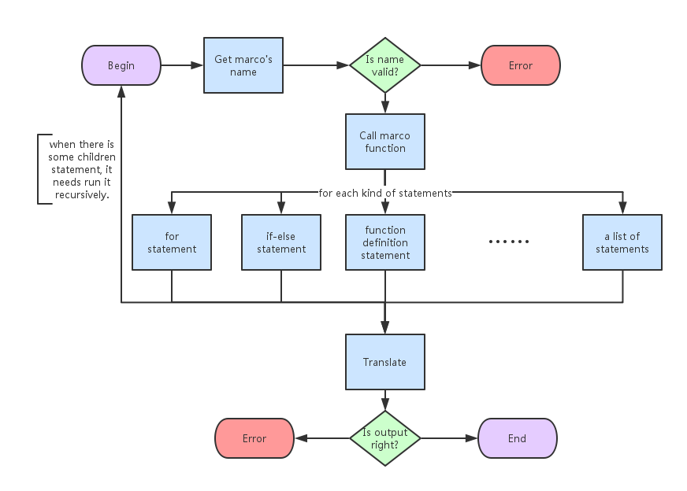

\pagebreak

## Core Features

RedApple is a fast, usable, C Style Compiler Infrastructure, which not only works independently as a little compiler, but also can be an embedding compiler library.

RedApple supports the following features:

1. Global Functions without Prior Declaration
2. Common Type System
3. Simplified Pointer
4. Constant Fields
5. Control Flow Statements
6. Metadata and Reflection
7. User Macros

Maybe a demo source code will show these features intuitively:

```c
int main() {
    // here we used the metadata to call
    // the 'print' function with its name
    FunctionCall("print", 5);
    return 0;
}


// user macro can make your grammar,
// and here we receved three parameters
defmacro for_n (p, size, code)  {
    for (int p = 1; p <= size; p = p+1)
        code;
}

void print(int k) {
    // call the user macro, i and k are two parameters,
    // the block '{}' is a parameter in its entirety.
    @for_n (i, k) {
        printf("hello-%d\n", i);
    }
}

```

Now we are going to discuss the design and how to make it.

\pagebreak


## Introduction

Most compilers adhere to the basic structural models which is known as Compiler Architecture. These models can be divided into five consecutive processes, known as Lexical Analysis, Syntactic Analysis, Semantic Analysis, and Target Code Generation.



We used LLVM Infrastructure[^1] to optimize our intermediate bitcode, and LLC[^2] to generate the object code. We should note that the optimiztion and target code generation steps are included in LLC. So our working flow will be like the following Figure \ref{f1}:


The special point is that the Semantic Analysis was replaced by Macro Translation, which is used to extend the grammar more conveniently.

When the object files are all created, compiler will call the linker of system to build the executable program. This linker stage has been shown in Figure \ref{linker}.




[^1]: LLVM - A collection of modular and reusable compiler and toolchain technologies. (from <http://llvm.org/>)
[^2]: LLC - LLVM Static Compiler (from <http://llvm.org/docs/CommandGuide/llc.html>)

\pagebreak

### Major Modules

RedApple Compiler have five major modules:

* Lexical analyzer and Parser (generated by Flex and Bison)  
    Which is used to analysis the structrue of input files.
* Node Models  
    The composition of AST(Abstract Syntax Tree)
* Pass Manager  
    Manage to run multi-pass translation
* Marco Translator  
    Same as Semantic Analysis
* Low-Level Code Generator  
    Unified abstraction layer for LLVM and other Code Generator

The call graph shows their relationships between each other:




\pagebreak


## Lexical Analysis and Parsing

To make a simple lexical analyzer, we used Flex[^3], same as Lex, an unix utility for generating lexical analyzer that perform pattern-matching on text. It reads the Lex configuration file and generate C/C++ code which can be compiled to a lexical analyzer library and has approximately the same high performance as hand-written analyzer.

A basic Lex configuration file has three parts which are splited by `%%`:

```c
/* C headers and definitions */

%%

 /* pattern-matching rules of tokens */

%%

/* user's C/C++ code */

```

Another core utility is Bison[^4], a parser generator employing LALR(1) parser tables and fully backward compatible with Yacc. It has the configuration file same as Lex and has been designed working together with it. Next, we are going to explain the first two steps and how they are designed.

Here is a basic calculator made by Bison, which parses and calculates the line of expression:

```c
/* parser.y */
/* Location tracking calculator.  */

%{
  #include <cmath>
  int yylex (void);
  void yyerror (char const *);
%}

/* Bison declarations.  */
%define api.value.type {int}
%token NUM

%left '-' '+'
%left '*' '/'
%precedence NEG
%right '^'

%% /* The grammar follows.  */

input:
  %empty
| input line
;

line:
  '\n'
| exp '\n' { printf ("%d\n", $1); }
;

exp:
  NUM           { $$ = $1; }
| exp '+' exp   { $$ = $1 + $3; }
| exp '-' exp   { $$ = $1 - $3; }
| exp '*' exp   { $$ = $1 * $3; }
| exp '/' exp
    {
      if ($3)
        $$ = $1 / $3;
      else
        {
          $$ = 1;
          fprintf (stderr, "%d.%d-%d.%d: division by zero",
                   @3.first_line, @3.first_column,
                   @3.last_line, @3.last_column);
        }
    }
| '-' exp %prec NEG     { $$ = -$2; }
| exp '^' exp           { $$ = pow ($1, $3); }
| '(' exp ')'           { $$ = $2; }

%%

int
main (void)
{
  return yyparse ();
}

```

[^3]: Flex - The Fast Lexical Analyzer (from <http://flex.sourceforge.net/>)
[^4]: Bison - GNU Bison is a general-purpose parser generator that converts an annotated context-free grammar into a deterministic LR or generalized LR (GLR) parser employing LALR(1) parser tables.(from <http://www.gnu.org/software/bison/>)


We find that all the tokens are undefined, as a matter of fact, which will be defined in the configuration file of Lex.

```lex
/* scanner.l */

%{

#include "parser.hpp"
#include <cstdlib>

#define SAVE_TOKEN     yylval = maketoken(yytext, yyleng)
extern "C" int yywrap() { return 1; }
int maketoken(const char* data, int len);
%}

%%

[0-9]+                  SAVE_TOKEN; return NUM;

"("                     return '(';
")"                     return ')';
"+"                     return '+';
"-"                     return '-';
"*"                     return '*';
"/"                     return '/';
"^"                     return '^';

%%

int maketoken(const char* data, int len) {
    char* str = new char[len+1];
    strncpy(str, data, len);
    str[len] = 0;
    int num = atoi(str);
    delete str;
    return num;
}

```

Each token defined by the 'parser.y' file will be a number which the pattern-matching returns in the 'scanner.l'  (A char also can be known as a number).

Summarize, lexical analysis used Regex as a pattern to split tokens, and the parser used BNF list to describe the grammar. The [lex](#apx1) and [parser](#apx2) source code have been listed separately in appendices, limited by space. Next, we will focus on some difficulties in lexical analysis.


### The Difficulties in Lexical Analysis

One of the difficulties is analysing the comment such as `/* */`. We need to enumerate all the possiblities in the Regex. The classic solution looks like:

```lex

%%
"/*"([^\*]|(\*)*[^\*/])*(\*)*"*/" ; /* the comment likes this kind */
 /* => */
"/*"   (  [^\*]   |   (\*)* [^\*/]   )*   (\*)*    "*/" ;
```

Returning nothing means that lexical analyzer will discard these statements, mainly for comments.

Some other important regexs have been listed below:

```lex
%{
#define SAVE_TOKEN     yylval.str = maketoken(yytext, yyleng)
#define SAVE_STRING    yylval.str = maketoken(yytext, yyleng)
#define SAVE_STRING_NC yylval.str = maketoken(yytext, yyleng)
%}

%%

/* some pattern-matching regexs */

[a-zA-Z_][a-zA-Z0-9_]*  SAVE_TOKEN; return ID;

[0-9]*\.[0-9]*          SAVE_TOKEN; return DOUBLE;
[0-9]+                  SAVE_TOKEN; return INTEGER;
0x[0-9A-Fa-f]+          SAVE_TOKEN; return INTEGER;

\"(\\.|[^\\"])*\"       SAVE_STRING; return STRING;
@\"(\\.|[^\\"])*\"      SAVE_STRING_NC; return STRING;
\'(\\.|.)\'             SAVE_STRING; return CHAR;

```

`maketoken` is a simple function for copying the string in C style and passes it into `yylval.str`, a C string pointer which is defined in `parser.y`, so that the data can be found in the parser.


### The Generator of Common Nodes Tree

Abstract Class `Node` which is the most usage of the functions to building the AST, can derive types of the leaf nodes. Those nodes may represent one kind of statements in our grammar, a simple expression, or just a number.

For the consideration about that our grammar should have extensibility, we won't arrange the statement node, and all kinds of the node types will be a basic constant or a data type.


We just defined some basic nodes for identity, types and constant fields:

* IDNode - which will contain an id-name
* TypeNode - a type string like "int[]"
* IntNode - just a integer
* StringNode - a raw string
* FloatNode - a float point number

These nodes enable to arrange to a list liking the code in lisp.

Here is the nodes tree of a main function:

```lisp
(function main () (
    ...
    (return 0)
))
```

Some other useful statements will be listed below:

```lisp
(int x 10)  ; define varibals

(* (+ a b) (- 10 3)) ; expression

(for (int i 0) (< i 10) (++ i) ; for statement
    ...
)

(if (() ; if-else statement
    (< i j)
    (++ i))
    (return i))

```


The model layer can be generated by its constructive functions which is named by 'Create'. Here is an example of if-statement:

```bison

if_state : IF '(' expr ')' statement
          { $$ = Node::make_list(3, IDNode::Create("if"), $3, $5); }

         | IF '(' expr ')' statement ELSE statement
          { $$ = Node::make_list(4, IDNode::Create("if"), $3, $5, $7); }
         ;

```

The function `Node::make_list`, which is common in use, can create a list by passing a variable number of parameters.


Figure \ref{f4} shows the inheritance relationship between the models.




### Traverse of The models

When the models have been created, the AST was confirmed. We can crawl the each node one by one or visit the needed node on its own.

`getChild()` and `getNext()` are used to traverse the AST, a left-child right-sibling binary tree.

Here is an example about for-statement in C style:

```c
for (i = 0; i < j; ++i)
    return i;

```

in lisp style:  


```lisp
(for (           ; for-else statement
        (= i 0) ; init
        (< i j) ; condition
        (++ i)) ; action
    (return i)) ; body
```

and the AST:  

  


\pagebreak


## Macro Translation

Macro Translation is an important stage for RedApple Compiler, replacing the Semantic Analysis stage and including an IR generator. It can run the multi-pass macro scanner to get the definitions of functions and types and translate them into the LLVM IR.

It's a recursive process to run the multi-pass macro scanner, that figure \ref{f5} has shown.



All marco functions need register before used, since this design let the module have a expansibility for user's new marco.

\pagebreak


### Order Problem of the Macro Scanning

It's hardly to make a one pass compiler which grammar looks like Java. We can't do all thing in one pass.

Think about this example:

```
void run(int p) {
    hard(p-1);
    ...
}

void hard(int p) {
    if (p==0) return;
    run(p-1);
    ...
}

```

The two functions, `run` and `hard`, called each other and you can't scan any one firstly.  
So our idea is to scan all the global names first, and collect the information about them. Their names will be stored in the Symbol Table, the bottom of the symbol table in stack fashion.

Before it, when there is a struct defined beside the function:

```
complex Add(complex x, complex y) {
    complex ans = new complex();
    ans.real = x.real + y.real;
    ans.imag = x.imag + y.imag;
    return ans;
}


struct complex {
    double real;
    double imag;
}


```

So, before we scan the functions, all types should be stored in Symbol Table.

Another pass need to preproccess is User Marco Pass, which is used to find the Marco defined by user and to perform macro substitution on AST nodes.

Here is the passes definition code in this project, which can be divided into four major passes. Each of the passes has the different kinds of marco-functions.

1. User Marco Pass
2. Scanning Types Pass
3. Scanning Functions Pass 
4. Main Pass

```c

extern const FuncReg macro_funcs[];
extern const FuncReg macro_classes[];
extern const FuncReg macro_prescan[];
extern const FuncReg macro_pretype[];
extern const FuncReg macro_defmacro[];

void PassManager::LoadDefaultLists() {
    list<Pass*> prescan = { 
        new Pass(macro_defmacro), 
        new Pass(macro_prescan), 
        new Pass(macro_pretype) };
    list<Pass*> main = { 
        new Pass(macro_funcs, macro_classes) };
    NewPassList("prescan", prescan);
    NewPassList("main", main);
}

```

`LoadDefaultLists` has defined two lists, one is the prescan list, the other is the main list.


### User Marcos and the Replacement


Definition of User Marcos is the feature of RedApple Compiler Infrastructure, which let user make their own grammar.

```c

void print(int k) {
	@for_n (i, k) {  // call user macro
		printf("hello-%d\n", i);
	}
}

defmacro for_n (p, size, code)  {  // define user macro
	for (int p = 1; p <= size; p = p+1)
		code;
}

int main() {
	print(5);
	return 0;
}
```

The code of previous paragraph will be translate into the code below, each name in the macro definition will be replaced:

```c
void print(int k) {
	for (int i = 1; i <= k; i = i+1) {
		printf("hello-%d\n", i);
	}
}

int main() {
	print(5);
	return 0;
}

```

Each user macro call should begin with a `@`, following the macro name, we pass arguments to it in the `()`, but the block `{}`, will be recognized as an entirety.

In one user macro call, we can pass lots of arguments until it's not `id`, `(` or `{`;

Here is our bnfs for the user macro grammar:

```bison

<macro_def_args> = [id:id] {{ return newIDNode(id.val); }}
                 | <macro_def_args:args> "," [id:id]
                 {{ addBrother(args, newIDNode(id.val));  return args; }}
                 ;

<marco_def> = "defmacro" [id:id] "(" <macro_def_args:args> ")" <block:b>
                {{return makeList(newIDNode("defmacro"), newIDNode(id.val), args, b);}}
            ;

<macro_call> = "@" [id:id] {{ return newIDNode(id.val); }}
             | <macro_call:m> "(" <macro_call_args:args> ")" 
             {{ addBrother(m, args); return m; }}
             | <macro_call:m> <block:b> {{ addBrother(m, getList(b)); return m; }}
             | <macro_call:m> [id:id] <block:b>
             {{ addBrother(m, newIDNode(id.val)); addBrother(m, getList(b)); return m; }}
             ;
```


### Meta Model of RedApple Grammar

We support simplied C style grammar, like functions and structs. An obvious difference is that RedApple has bound meta data for reflection.

Each kind of the meta data has a class inherited from `MetaModel`, which can store all of the information about it.

When we have generated the code, those information will be written by lists in the `meta.bc`. All of the meta data which has a common constructor function in C++ style, will be the initialization part of the program.

We have all the names of functions and all the types definitions in the meta data. So we can call those functions from string, using the runtime function `FunctionCall`, as the way below.

```cpp

int work(int k) {
    ...
}

int main() {
    return FunctionCall("work", 0);
}

```


The source of `MetaModel` is a simple type value with a name string:

```cpp
class MetaModel : public lvalue
{
public:
	MetaModel(std::string);
	virtual ~MetaModel();

	virtual void insertToST(CodeGenContext* context) = 0;
	virtual void genCode(CodeGenContext* context) = 0;
	virtual void genMetaCode(CodeGenContext* context) = 0;
	virtual MetaType getMetaType() = 0;

	static MetaModel* readJson();
	static MetaModel* readMetaCode();
protected:
	std::string name;
};

```

When we need to generate the metadata, function `genMetaCode` is used to do this work. It will use the LLVM api to generate lists containing of the serialization of its metadata.

The resolve of the metadata is working in the runtim library, so we just need to write them to the LLVM IR file as the initialized value of the list:

```cpp

void FunctionModel::genMetaCode(CodeGenContext* context) {
	vector<string> data;
	data.push_back(return_type); // return type
	for (int i = 0; i < name_list.size(); ++i) {
		data.push_back(type_list[i]); // args type
		data.push_back(name_list[i]); // args name
	}
	context->getLLCG()->MakeMetaList(name, data, func_type);
}

```


The runtime library is an indispensable part of the metadata module, since we need to record the metadata in a series of runtime data structures. In the other hand, runtime functions is a bridge of the program and the metadata system. To call the function dynamically, we used the dyncall library to invoke every possible calls. To call this function `sqrt`, we use the full dynamical way:

```
double sqrt(double x);

void call() {
    double r;
    DCCallVM* vm = dcNewCallVM(4096);
    dcMode(vm, DC_CALL_C_DEFAULT);
    dcReset(vm);
    dcArgDouble(vm, 4.2373);
    r = dcCallDouble(vm, (DCpointer)&sqrt);
    dcFree(vm);
}
```

So the principle of the function `FunctionCall` is to read all right parameters known form metadata and to call the function pointer with the dyncall library dynamically.


\pagebreak


## Low-Level Code Generator

Low-Level Code Generator is an unified layer for LLVM-like code Generator, which is used to keep off the strong dependency of LLVM. It has been designed as an abstract class or an interface to generate IR code from a high level, so that most of marco translation just need only one function call.

To generate a for statement, the virtual function at the interface is `llcg::For`:

```cpp
static LValue for_macro(CodeGenContext* context, Node* node) {
	// for statement has a local symbol table
    context->st->push();
    
	// argument 1 - initialization statement
	LValue init_block = context->getLLCG()->GetNowBasicBlock();
	context->MacroMake(node);

	// argument 2 - end condition
	node = node->getNext();
	LValue end_block = context->getLLCG()->CreateBasicBlock();
	LValue condition = context->MacroMake(node);

	// argument 3 - iteration
	node = node->getNext();
	LValue do_block = context->getLLCG()->CreateBasicBlock();
	context->MacroMake(node);

	// argument 4 - body
	node = node->getNext();
	LValue work_block = context->getLLCG()->CreateBasicBlock();

	LValue false_block = context->getLLCG()->CreateBasicBlock();

	// for break and continue
	context->st->insert("break", conditions_t, false_block);
	context->st->insert("continue", conditions_t, end_block);
	
    context->getLLCG()->SetNowBasicBlock(work_block);
	context->MacroMake(node);
    
	LValue work_end_block = context->getLLCG()->GetNowBasicBlock();
	context->getLLCG()->SetNowBasicBlock(false_block);
    
	// making a 'for' statement
	context->getLLCG()->For(condition, init_block, end_block, do_block, work_block, work_end_block, false_block);

	context->st->pop();
	return NULL;
}
```

Function `getLLCG()` will return the object of the LLCG interface, and `CreateBasicBlock` or `GetNowBasicBlock` can create/get the basicblock in the function, which is a series of IR code.


### The Container of LLVM Value

`LValue` is a key struct about LLVM Value which is ensured having the right type of it. Almost llvm functions about generator will return the type `llvm::Value` and `llvm::Type`. For cutting off the coupling between Low-Level Code Generator layer and our main module, we used `LValue` class to wrap `llvm::Value` and `llvm::Type` objects.

We won't find any relationship with LLVM api, so it's easy to inherite another IR generator such as JVM or MSIL. 

```cpp
class lvalue;
typedef shared_ptr<lvalue> LValue;

class lvalue
{
public:
	virtual bool isStructType() {
		return false;
	}

	virtual LValue getType() {
		return NULL;
	}

	virtual string getTypeName() {
		return "";
	}

	virtual LValue getPointerTo() {
		return NULL;
	}

};

```


It's possible to making a kind of special value container to save the LLVM Value.


```cpp
#include "lvalue.h"

class llvm_value;

typedef shared_ptr<llvm_value> LLVMValue;
#define LLVALUE(T) dynamic_pointer_cast<llvm_value>(T)

namespace llvm {
	class Value;
} // llvm

class llvm_value : public lvalue
{
public:
	llvm_value(llvm::Value* v);
	virtual ~llvm_value();
	
	operator llvm::Value* () const { return data; }
	virtual string getTypeName();
	
private:
	llvm::Value* data;
};
```


\pagebreak


## Appendices


### Appendix I - The Source Code of Lex   {#apx1}

```lex
// redapple_lex.l 
%{
#include <string>
#include "Model/nodes.h"
#include <list>
using namespace std;

#include "redapple_parser.hpp"

#define SAVE_TOKEN     yylval.str = maketoken(yytext, yyleng)
#define SAVE_STRING    yylval.str = maketoken(yytext, yyleng)
#define SAVE_STRING_NC yylval.str = maketoken(yytext, yyleng)
extern "C" int yywrap() { return 1; }
char* maketoken(const char* data, int len);
%}

%option yylineno

%%

"/*"([^\*]|(\*)*[^\*/])*(\*)*"*/" ; /* 就是这种注释 */ 

#[^\n]*\n               ; /* 井号注释 */ 
"//"[^\n]*\n            ; /* 双线注释 */ 

[ \t\v\n\f]             ; /* 过滤空白字符 */

    /* 一些双元运算符 */
"++"                    return PP;
"--"                    return SS;
"<-"                    return LF;
"->"                    return RF;
"&&"                    return AND;
"||"                    return OR;
"!"                     return '!';
"::"                    return NSP;


"+="                    return PE;
"-="                    return SE;
"*="                    return ME;
"/="                    return DE;
"&="                    return AE;
"|="                    return OE;
"^="                    return XE;
"%="                    return MODE;
"<<="                   return FLE;
">>="                   return FRE;


    /* 比较运算符 */
"=="                    return CEQ;
"<="                    return CLE;
">="                    return CGE;
"!="                    return CNE;
"<"                     return '<';
">"                     return '>';


    /* 界符 */
"("                     return '(';
")"                     return ')';
"["                     return '[';
"]"                     return ']';
"{"                     return '{';
"}"                     return '}';
"."                     return '.';
","                     return ',';
"?"                     return '?';
":"                     return ':';
";"                     return ';';
"[]"                    return SZ;


    /* 基本运算符 */
"="                     return '=';
"+"                     return '+';
"-"                     return '-';
"*"                     return '*';
"/"                     return '/';
"%"                     return '%';
"^"                     return '^';
"&"                     return '&';
"|"                     return '|';
"~"                     return '~';

    /* 宏运算符 */
"@"                     return '@';
",@"                    return MBK;
"`"                     return '`';
    /* 下面声明要用到的关键字 */

    /* 控制流 */
"if"                    return IF;
"else"                  return ELSE;
"while"                 return WHILE;
"do"                    return DO;
"until"                 return UNTIL;
"goto"                  return GOTO;
"for"                   return FOR;
"foreach"               return FOREACH;

    /* 退出控制 */
"break"|"continue"|"exit"   SAVE_TOKEN; return KWS_EXIT;

"return"                return RETURN;

    /* 特殊运算符 */
"new"                   return NEW;
"delete"                return DELETE;
"this"                  return THIS;
    
    /* 特殊定义 */
"delegate"              return DELEGATE;
"def"                   return DEF;
"define"                return DEFINE;
"defmacro"              return DEFMACRO;
"import"                return IMPORT;
"using"                 return USING;
"namespace"             return NAMESPACE;
"const"                 return CONST;
"packed"                return PACKED;
"volatile"              return VOLATILE;
"woven"                 return WOVEN;

"try"|"catch"|"finally"|"throw"  SAVE_TOKEN; return KWS_ERROR; /* 异常控制 */

"null"|"true"|"false"               SAVE_TOKEN; return KWS_TSZ; /* 特殊值 */

"struct"|"enum"|"union"|"module"|"interface"|"class"     SAVE_TOKEN; return KWS_STRUCT; /* 结构声明 */

"public"|"private"|"protected"  SAVE_TOKEN; return KWS_FWKZ; /* 访问控制 */

"static"|"extern"|"virtual"|"abstract"|"in"|"out"        SAVE_TOKEN; return KWS_FUNC_XS; /* 函数修饰符 */

"var"|"auto"            SAVE_TOKEN; return KWS_TYPE; /* 基本类型 */

[a-zA-Z_][a-zA-Z0-9_]*  SAVE_TOKEN; return ID; /* 标识符 */

-?[0-9]*\.[0-9]*        SAVE_TOKEN; return DOUBLE;
-?[0-9]+                SAVE_TOKEN; return INTEGER;
0x[0-9A-Fa-f]+          SAVE_TOKEN; return INTEGER;

\"(\\.|[^\\"])*\"       SAVE_STRING; return STRING; /* 字符串 */
@\"(\\.|[^\\"])*\"      SAVE_STRING_NC; return STRING; /* 无转义字符串 */
\'(\\.|.)\'             SAVE_STRING; return CHAR;   /* 字符 */

.                       printf("Unknown Token!\n"); yyterminate();

%%


char* maketoken(const char* data, int len) {
    char* str = new char[len+1];
    strncpy(str, data, len);
    str[len] = 0;
    return str;
}

```

### Appendix II - The Source Code of Parser  {#apx2}


```bison
// redapple_parser.y

%{
#include "Model/nodes.h"
#include <list>
using namespace std;

#define YYERROR_VERBOSE 1

Node *programBlock; /* the top level root node of our final AST */

extern int yylex();
extern int yylineno;
extern char* yytext;
extern int yyleng;

void yyerror(const char *s);

%}

 

/* Represents the many different ways we can access our data */

%union {
    Node *nodes;
    char *str;
    int token;
}

 

/* Define our terminal symbols (tokens). This should

   match our tokens.l lex file. We also define the node type

   they represent.

 */

%token <str> ID INTEGER DOUBLE
%token <token> CEQ CNE CGE CLE MBK
%token <token> '<' '>' '=' '+' '-' '*' '/' '%' '^' '&' '|' '~' '@' '?' ':'
%token <token> PP SS LF RF AND OR '!' NSP PE SE ME DE AE OE XE MODE FLE FRE SZ
%token <str> STRING CHAR
%token <token> IF ELSE WHILE DO UNTIL GOTO FOR FOREACH 
%token <token> DELEGATE DEF DEFINE IMPORT USING NAMESPACE DEFMACRO CONST PACKED VOLATILE WOVEN
%token <token> RETURN NEW THIS DELETE
%token <str> KWS_EXIT KWS_ERROR KWS_TSZ KWS_STRUCT KWS_FWKZ KWS_FUNC_XS KWS_TYPE

/* 
   Define the type of node our nonterminal symbols represent.
   The types refer to the %union declaration above. Ex: when
   we call an ident (defined by union type ident) we are really
   calling an (NIdentifier*). It makes the compiler happy.
 */

%type <nodes> program
%type <nodes> def_module_statement
%type <nodes> def_module_statements
%type <nodes> def_statement
%type <nodes> def_statements
%type <nodes> for_state
%type <nodes> if_state
%type <nodes> while_state
%type <nodes> dowhile_state
%type <nodes> dountil_state
%type <nodes> statement
%type <nodes> statements
%type <nodes> block
%type <nodes> types
%type <nodes> var_def
%type <nodes> marco_def
%type <nodes> macro_def_args
%type <nodes> macro_call
%type <nodes> func_def
%type <nodes> func_def_args
%type <nodes> func_def_xs 
%type <nodes> numeric
%type <nodes> expr
%type <nodes> call_arg 
%type <nodes> call_args 
%type <nodes> return_state
%type <nodes> new_expr delete_expr
%type <nodes> var_exp
%type <nodes> macro_call_args
%type <nodes> list full_list woven_state


//%type <token> operator 这个设计容易引起规约冲突，舍弃
/* Operator precedence for mathematical operators */


%left AE OE XE MODE FLE FRE
%left PE SE    
%left ME DE
%left '&' '|'
%left CEQ CNE CLE CGE '<' '>' '='
%left '+' '-'
%left '*' '/' '%' '^'
%left '.'
%right '~' PP SS
%left '(' '[' ')' ']'
%left MBK '@'

%start program

%%

program : def_statements { programBlock = Node::getList($1); }
        ;

def_module_statement : KWS_STRUCT ID '{' def_statements '}' { $$ = Node::make_list(3, IDNode::Create($1), IDNode::Create($2), $4); }
                     | KWS_STRUCT ID ';' { $$ = Node::make_list(3, IDNode::Create($1), IDNode::Create($2), Node::Create()); }
                     ;

def_module_statements  : def_module_statement { $$ = Node::getList($1); }
                       | def_module_statements def_module_statement { $$ = $1; $$->addBrother(Node::getList($2)); }
                       ;

func_def_xs : KWS_FUNC_XS { $$ = IDNode::Create($1); }
            | func_def_xs KWS_FUNC_XS {$$ = $1; $$->addBrother(IDNode::Create($2)); }
            ;

def_statement : var_def ';' { $$ = $1; }
              | func_def 
              | marco_def
              | macro_call
              | '`' full_list { $$ = $2; }
              | def_module_statement 
              | func_def_xs func_def { $$ = $2; $2->addBrother(Node::Create($1)); } 
              | IMPORT STRING { $$ = Node::make_list(2, IDNode::Create("import"), IDNode::Create($2) ); }
              ;

def_statements : def_statement { $$ = Node::getList($1); }
               | def_statements def_statement { $$ = $1; $$->addBrother(Node::getList($2)); }
               ;

statements : statement { $$ = Node::getList($1); }
           | statements statement { $$ = $1; $$->addBrother(Node::getList($2)); }
           ;

statement : def_statement 
          | expr ';' { $$ = $1; } 
          | block 
          | if_state
          | while_state
          | dowhile_state
          | dountil_state
          | for_state
          | return_state
          | delete_expr ';' { $$ = $1; }
          ;

if_state : IF '(' expr ')' statement { $$ = Node::make_list(3, IDNode::Create("if"), $3, $5); }
         | IF '(' expr ')' statement ELSE statement { $$ = Node::make_list(4, IDNode::Create("if"), $3, $5, $7); }
         ;

while_state : WHILE '(' expr ')' statement { $$ = Node::make_list(3, IDNode::Create("while"), $3, $5); }
            ;

dowhile_state : DO statement WHILE '(' expr ')' ';' { $$ = Node::make_list(3, IDNode::Create("dowhile"), $2, $5); }
              ;
dountil_state : DO statement UNTIL '(' expr ')' ';' { $$ = Node::make_list(3, IDNode::Create("dountil"), $2, $5); }
              ;

for_state : FOR '(' expr ';' expr ';' expr ')' statement { $$ = Node::make_list(5, IDNode::Create("for"), $3, $5, $7, $9); }
          | FOR '(' var_def ';' expr ';' expr ')' statement { $$ = Node::make_list(5, IDNode::Create("for"), Node::Create($3), $5, $7, $9); }
          ;

return_state : RETURN ';' { $$ = IDNode::Create("return"); }
             | RETURN expr ';' { $$ = IDNode::Create("return"); $$->addBrother($2); }              

woven_state : WOVEN ID '(' call_args ')' { $$ = Node::make_list(2, IDNode::Create("woven"), IDNode::Create($2)); $$->addBrother($4); }
            ;

block : '{' statements '}' { $$ = Node::Create($2); }
      | '{' '}' { $$ = Node::Create(); }
      ; 

types : ID { $$ = TypeNode::Create($1, false); }
      | CONST ID { $$ = TypeNode::Create($2, true); }
      | '*' ID { $$ = TypeNode::Create($2, false, true); }
      | CONST '*' ID { $$ = TypeNode::Create($3, true, true); }
      | types SZ { $$ = $1; ((TypeNode*)$1)->addDimension(); }
      ;

var_def : types ID { $$ = Node::make_list(3, IDNode::Create("set"), $1, IDNode::Create($2)); }
        | types ID '=' expr { $$ = Node::make_list(4, IDNode::Create("set"), $1, IDNode::Create($2), $4); }
        ;

macro_def_args : ID { $$ = IDNode::Create($1); }
               | macro_def_args ',' ID { $$ = $1; $1->addBrother(IDNode::Create($3)); }
               ;

marco_def : DEFMACRO ID '(' macro_def_args ')' block
            { $$ = Node::make_list(4, IDNode::Create("defmacro"), IDNode::Create($2), $4, $6); }
          ;

macro_call : '@' ID { $$ = IDNode::Create($2); }
           | macro_call '(' macro_call_args ')' { $$ = $1; $$->addBrother($3); }
           | macro_call block { $$ = $1; $$->addBrother(Node::getList($2)); }
           | macro_call ID block { $$ = $1; $$->addBrother(IDNode::Create($2)); $$->addBrother(Node::getList($3)); }
           ;

func_def : types ID '(' func_def_args ')' block
            { $$ = Node::make_list(5, IDNode::Create("function"), $1, IDNode::Create($2), $4, $6); }
         | types ID '(' func_def_args ')' ';'
            { $$ = Node::make_list(5, IDNode::Create("function"), $1, IDNode::Create($2), $4, Node::Create()); }
         ;

func_def_args : var_def { $$ = Node::Create(Node::Create($1)); }
              | func_def_args ',' var_def { $$ = $1; $$->addChildren(Node::Create($3)); }
              | %empty  { $$ = Node::Create(); }
              ;


new_expr : NEW types { $$ = Node::make_list(3, IDNode::Create("new"), $2, Node::Create()); }
         | NEW types '(' call_args ')'  { $$ = Node::make_list(3, IDNode::Create("new"), $2, Node::Create($4)); }
         | new_expr '[' call_args ']' { $$ = $1; $1->addBrother(Node::Create($3)); }
         ;

delete_expr : DELETE expr { $$ = Node::make_list(2, IDNode::Create("delete"), $2); }
            | DELETE '[' ']' expr { $$ = Node::make_list(2, IDNode::Create("delete[]"), $4); }
            ;

numeric : INTEGER { $$ = IntNode::Create($1); }
        | DOUBLE { $$ = FloatNode::Create($1); }
        ;

var_exp : ID { $$ = IDNode::Create($1); }
        | numeric 
        | STRING { $$ = StringNode::Create($1); }
        | KWS_TSZ { $$ = IDNode::Create($1); }
        ;

expr : expr '=' expr { $$ = Node::make_list(4, IDNode::Create("opt2"), IDNode::Create("="), $1, $3); }
     | expr '(' call_args ')' { $$ = Node::make_list(2, IDNode::Create("call"), $1); $$->addBrother($3); }
     | expr '[' call_args ']' { $$ = Node::make_list(2, IDNode::Create("select"), $1); $$->addBrother($3); } 
     | new_expr
     | var_exp
     | expr CEQ expr { $$ = Node::make_list(4, IDNode::Create("opt2"), IDNode::Create("=="), $1, $3); }
     | expr CNE expr { $$ = Node::make_list(4, IDNode::Create("opt2"), IDNode::Create("!="), $1, $3); }
     | expr CLE expr { $$ = Node::make_list(4, IDNode::Create("opt2"), IDNode::Create("<="), $1, $3); }
     | expr CGE expr { $$ = Node::make_list(4, IDNode::Create("opt2"), IDNode::Create(">="), $1, $3); }
     | expr '<' expr { $$ = Node::make_list(4, IDNode::Create("opt2"), IDNode::Create("<"), $1, $3); }
     | expr '>' expr { $$ = Node::make_list(4, IDNode::Create("opt2"), IDNode::Create(">"), $1, $3); }
     | expr '<' '<' expr { $$ = Node::make_list(4, IDNode::Create("opt2"), IDNode::Create("<<"), $1, $3); }
     | expr '>' '>' expr { $$ = Node::make_list(4, IDNode::Create("opt2"), IDNode::Create(">>"), $1, $3); }
     | expr '+' expr { $$ = Node::make_list(4, IDNode::Create("opt2"), IDNode::Create("+"), $1, $3); }
     | expr '-' expr { $$ = Node::make_list(4, IDNode::Create("opt2"), IDNode::Create("-"), $1, $3); }
     | expr '*' expr { $$ = Node::make_list(4, IDNode::Create("opt2"), IDNode::Create("*"), $1, $3); }
     | expr '/' expr { $$ = Node::make_list(4, IDNode::Create("opt2"), IDNode::Create("/"), $1, $3); }
     | expr '%' expr { $$ = Node::make_list(4, IDNode::Create("opt2"), IDNode::Create("%"), $1, $3); }
     | expr '^' expr { $$ = Node::make_list(4, IDNode::Create("opt2"), IDNode::Create("^"), $1, $3); }
     | expr '&' expr { $$ = Node::make_list(4, IDNode::Create("opt2"), IDNode::Create("&"), $1, $3); }
     | expr '|' expr { $$ = Node::make_list(4, IDNode::Create("opt2"), IDNode::Create("|"), $1, $3); }
     | expr PE expr { $$ = Node::make_list(4, IDNode::Create("opt2"), IDNode::Create("+="), $1, $3); }
     | expr SE expr { $$ = Node::make_list(4, IDNode::Create("opt2"), IDNode::Create("-="), $1, $3); }
     | expr ME expr { $$ = Node::make_list(4, IDNode::Create("opt2"), IDNode::Create("*="), $1, $3); }
     | expr DE expr { $$ = Node::make_list(4, IDNode::Create("opt2"), IDNode::Create("/="), $1, $3); }
     | expr MODE expr { $$ = Node::make_list(4, IDNode::Create("opt2"), IDNode::Create("%="), $1, $3); }
     | expr XE expr { $$ = Node::make_list(4, IDNode::Create("opt2"), IDNode::Create("^="), $1, $3); }
     | expr AE expr { $$ = Node::make_list(4, IDNode::Create("opt2"), IDNode::Create("&="), $1, $3); }
     | expr OE expr { $$ = Node::make_list(4, IDNode::Create("opt2"), IDNode::Create("|="), $1, $3); }
     | expr FLE expr { $$ = Node::make_list(4, IDNode::Create("opt2"), IDNode::Create("<<="), $1, $3); }
     | expr FRE expr { $$ = Node::make_list(4, IDNode::Create("opt2"), IDNode::Create(">>="), $1, $3); }
     | expr '.' expr { $$ = Node::make_list(4, IDNode::Create("opt2"), IDNode::Create("."), $1, $3); }
     | '~' expr { $$ = Node::make_list(3, IDNode::Create("opt1"), IDNode::Create("~"), $2); }
     | PP expr { $$ = Node::make_list(3, IDNode::Create("opt1"), IDNode::Create("++"), $2); }
     | SS expr { $$ = Node::make_list(3, IDNode::Create("opt1"), IDNode::Create("--"), $2); }
     | expr PP { $$ = Node::make_list(3, IDNode::Create("opt1"), IDNode::Create("b++"), $1); }
     | expr SS { $$ = Node::make_list(3, IDNode::Create("opt1"), IDNode::Create("b--"), $1); }
     | '(' expr ')'  /* ( expr ) */  { $$ = $2; }
     ;

call_arg  :  expr { $$ = $1;  }
          |  ID '=' expr { $$ = Node::make_list(3, IDNode::Create("="), $1, $3); }
          ;

call_args : %empty { $$ = NULL; }
          | call_arg { $$ = Node::getList($1); }
          | call_args ',' call_arg  { $$ = $1; $$->addBrother(Node::getList($3)); }
          ;

macro_call_args : %empty { $$ = Node::Create(); }
                | call_arg { $$ = Node::getList($1); }
                | macro_call { $$ = Node::getList($1); }
                | macro_call_args ',' call_arg  { $$ = $1; $$->addBrother(Node::getList($3)); }
                | macro_call_args ',' macro_call  { $$ = $1; $$->addBrother(Node::getList($3)); }
                ;

list : var_exp
     | full_list
     | '!' types { $$ = $2; }
     | list var_exp { $$ = $1; $$->addBrother($2); }
     | list full_list { $$ = $1; $$->addBrother($2); }
     | list '!' types  { $$ = $1; $$->addBrother($3); }
     ;

full_list : '(' list ')' { $$ = Node::Create($2); }
          ;
%%

void yyerror(const char* s){
    fprintf(stderr, "%s \n", s);    
    fprintf(stderr, "line %d: ", yylineno);
    fprintf(stderr, "text %s \n", yytext);
    exit(1);
}
```


### Appendix III - The source code of FunctionCall

The source code of the runtime function, `FunctionCall`:

```c
void* FunctionCall(const char* name, ...) {
    string sname = name;
    FunctionMeta* fm = EliteMeta::getFunction(sname);
    if (fm == NULL) {
        printf("运行时异常, 反射调用的函数未找到: %s\n", name);
        return NULL;
    }
    va_list argp;                   /* 定义保存函数参数的结构 */
    va_start( argp, name );

    // 设定调用栈
    DCCallVM* vm = EliteMeta::getInstance().vm;
    dcMode(vm, DC_CALL_C_DEFAULT);
    dcReset(vm);

    for (auto& s : fm->type_list) {
        NormalType t = EliteMeta::getNormalType(s);
        switch (t) {
            case int_normal_t:    dcArgInt(vm, va_arg(argp, int));  break;
            case float_normal_t:  dcArgFloat(vm, (float)va_arg(argp, double)); break; // 默认参数提升
            case double_normal_t: dcArgDouble(vm, va_arg(argp, double)); break;
            case char_normal_t:   dcArgShort(vm, (short)va_arg(argp, int)); break;
            case byte_normal_t:   dcArgChar(vm, (char)va_arg(argp, int)); break;
            case ptr_normal_t:    dcArgPointer(vm, va_arg(argp, void*)); break;
            default:
                printf("函数类型异常: %s 类型不能作为参数\n", s.c_str());
                va_end( argp );                                   /* 将argp置为NULL */
                return NULL;
        }
    }
    va_end( argp );                                   /* 将argp置为NULL */
    void* ans;
    DCpointer fptr = (DCpointer)(fm->function_ptr);
    NormalType t = EliteMeta::getNormalType(fm->ret_type);
        switch (t) {
            case void_normal_t:  ans = NULL;   dcCallVoid(vm, fptr); break;
            case int_normal_t:    ans = (void*)dcCallInt(vm, fptr);  break;
            // case float_normal_t : ans = (void*) dcCallFloat(vm, fptr); break;
            // case double_normal_t :ans = (void*) dcCallDouble(vm, fptr); break;
            case char_normal_t:  ans = (void*)dcCallShort(vm, fptr); break;
            case byte_normal_t:  ans = (void*)dcCallChar(vm, fptr); break;
            case ptr_normal_t:   ans = (void*)dcCallPointer(vm, fptr); break;
            default:
                printf("函数类型异常: %s 类型不能作为返回类型\n", fm->ret_type.c_str());
                return NULL;
        }
    return ans;
}

```
